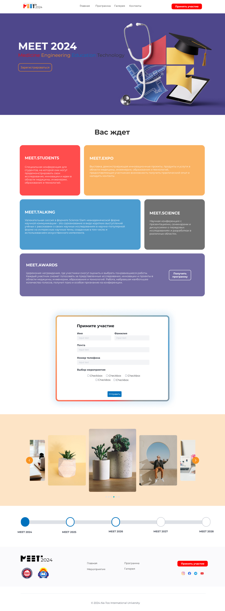
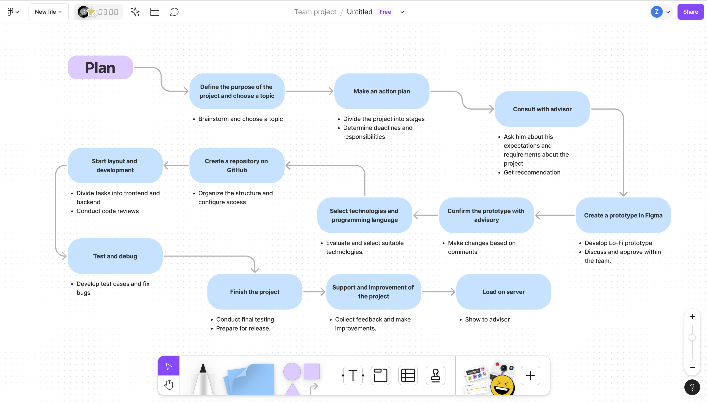

<h1>Meet Conference Website</h1>

<h4>This project was created using Django.</h4>

<h2>Table of contents:</h2>
<li><a href="https://www.figma.com/design/kwEIidifUM9AHK9uA00mep/internship?node-id=0-1&t=TOgW2PeC8V3APVui-1">Figma link</a></li>

<li><a href="https://www.figma.com/board/ZzxF2bUOzWGp376WDZHn9U/Untitled?node-id=0-1&t=AEOjy12XXoKxWafG-1">Architecture</a></li>

<li><a href="https://drive.google.com/file/d/1xOGeEULd84zWKSKca3Dcdi2s6TnA8trV/view?usp=share_link">Video</a></li>

<h2>Figma Design</h2>

Figma: <a href="https://www.figma.com/design/kwEIidifUM9AHK9uA00mep/internship?node-id=0-1&t=TOgW2PeC8V3APVui-1">link</a>

<h2>Architeccture</h2>

<h4>This is the plan on the basis of which we completed the project</h4>

Plan: <a href="https://www.figma.com/board/ZzxF2bUOzWGp376WDZHn9U/Untitled?node-id=0-1&t=AEOjy12XXoKxWafG-1">link</a>

<h2>Launch</h2>

1) Download the repository

2) Open cd Meet_Conference
   
3) Create venv: python -m venv venv

4) Activate venv: source venv/bin/activate or  ./venv/bin/activate (MacOS or linux), .\venv\Scripts\activate (Windows)

5) Than open cd meet2024

6) Run the server: python manage.py runserver

7) Click on link thats on terminal
